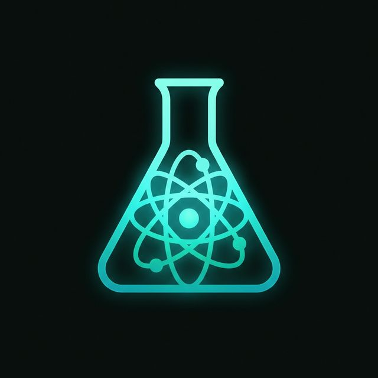

<div align="center">
  
  <h1>Chemify</h1>
  <p><strong>Chemistry, finally made visual.</strong></p>
  
  <p>
    <a href="#features">Features</a> •
    <a href="#who-is-it-for">Who is it for?</a> •
    <a href="#getting-started">Getting Started</a>
  </p>
</div>

---

**Chemify** is a modern chemistry platform for scientists, students, and researchers to explore elements, reactions, and powerful tools. Instead of memorizing static tables and abstract equations, explore elements and reactions through intuitive visuals and real-time simulations.

## ✨ Features

🔬 **Periodic Table Explorer**
Navigate through every element with rich detail — atomic structure, electron configuration, isotopes, and real-world uses, all visualized beautifully.

🧪 **Reaction Studio**
Combine elements, balance equations, and watch reactions unfold in real time. Understand stoichiometry through intuitive, interactive simulations.

🧮 **Chemistry Tools**
Molar mass calculators, unit converters, equation balancers, and more — a complete toolkit designed to save you time in the lab or classroom.

## 🎯 Who is it for?

- 🎓 **Students:** Master the fundamentals with interactive visuals that make complex concepts click instantly. Study smarter, not harder.
- 👨‍🔬 **Researchers:** Access detailed element data, reaction pathways, and precision tools built for professional-grade exploration and analysis.
- 💡 **Curious Minds:** No lab coat required. Dive into the beauty of chemistry through playful exploration and discover what everything is made of.

## 🚀 Getting Started

Chemify is built using pure **HTML, CSS, and JavaScript**. No complex build tools or dependencies are required.

1. **Clone the repository:**
   ```bash
   git clone <your-repository-url>
   ```
2. **Open the project:**
   Simply open `index.html` in any modern web browser to start exploring!

## 📁 Project Structure

```text
Chemify/
├── index.html           # Main landing page
├── styles.css           # Global stylesheets
├── script.js            # Landing page interactivity
├── pages/               
│   ├── explorer/        # Element Explorer module
│   ├── lab/             # Reaction Studio module
│   └── tools/           # Chemistry Toolkit module
└── assets/              # Icons, graphics, and images
```

## 📄 License
Built with curiosity. © 2025 Chemify.
